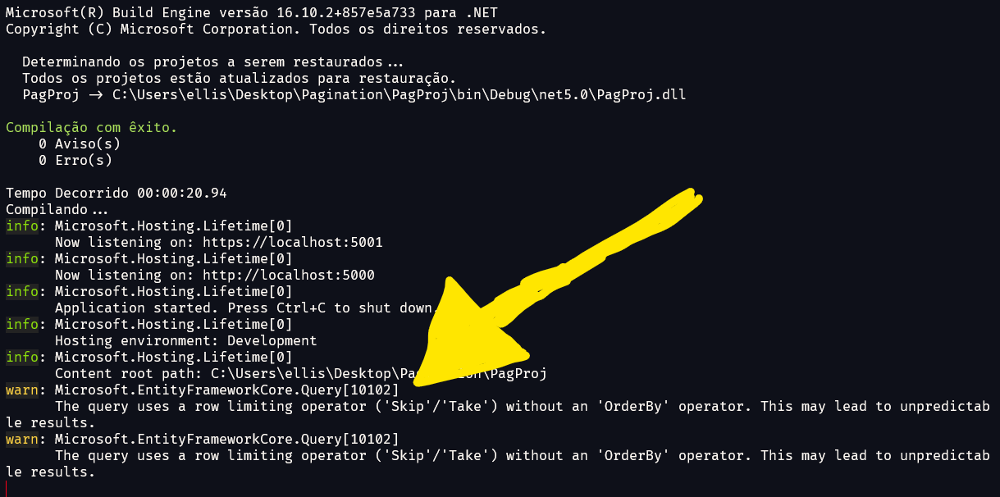

# Paginação de Dados

Nesse repositório implementamos ==paginação== de dados com ASP.NET 5 Web API. Nesse projeto utilizamos o Padrão Repositório (*Repository Patern*) e Repositório Genérico (*GenericRepository*) junto ao ORM *Entity Framework* para acessar os dados no banco. 

O projeto tem a seguinte estrutura:

```xml
PagProj
    │   appsettings.Development.json
    │   appsettings.json
    │   PagProj.csproj
    │   Program.cs
    │   Startup.cs
    │
    ├───Business
    │   │   StudentBusiness.cs
    │   │
    │   └───Interface
    │           IStudentBusiness.cs
    │
    ├───Controllers
    │       StudentController.cs
    │
    ├───Models
    │   │   BaseEntity.cs
    │   │   Student.cs
    │   │
    │   ├───Context
    │   │       ApplicationContext.cs
    │   │
    │   └───Pagination
    │           PagedList.cs
    │           PaginationParameters.cs
    │
    └───Repository
        │   GenericRepository.cs
        │
        ├───Interface
        │       IRepository.cs
        │
        └───Scripts
                students.sql
```

Para demostrar paginação, usamos o modelo `Student`:

```C#
using System;
using System.ComponentModel.DataAnnotations.Schema;

namespace PagProj.Models
{
    [Table("students")]
    public class Student : BaseEntity
    {
        [Column("full_name")]
        public string FullName { get; set; }
        
        [Column("birth_date")]
        public DateTime BirthDate { get; set; }

        [Column("document")]
        public string Document { get; set; }

        [Column("phone_number")]
        public string PhoneNumber { get; set; }

        [Column("full_address")]
        public string FullAddress { get; set; }
    }
}
```

Esse modelo, herda de `BaseEntity`:

```C#
using System.ComponentModel.DataAnnotations;
using System.ComponentModel.DataAnnotations.Schema;

namespace PagProj.Models {
    public class BaseEntity {
        [Key]
        [Column("id")]
        public long Id { get; set; }
    }
}
```

> O modelo `BaseEntity` é utilizado para limitar o `GenericRepository`. Todas os modelos do domínio terão herança desta classe, que assim como no banco de dados, todas elas tem uma coluna `id`.

Na pasta ==Repository > Scripts== contém o Script para construção do banco de dados de `students`:

```sql
CREATE DATABASE paginationdb;
USE paginationdb;

CREATE TABLE students (
	id INT(11) NOT NULL AUTO_INCREMENT,
	full_name VARCHAR(100) NOT NULL DEFAULT '0',
	birth_date DATE NULL DEFAULT NULL,
	document VARCHAR(100) NOT NULL DEFAULT '0',
	phone_number VARCHAR(100) NOT NULL DEFAULT '0',
	full_address VARCHAR(130) NOT NULL DEFAULT '0',
	PRIMARY KEY (id)
)
ENGINE=InnoDB DEFAULT CHARSET=LATIN1;

insert into students (full_name, birth_date, document, phone_number, full_address) values ('Bobby', '2021-02-08', '154937604-7', '117-452-5548', '367 Tony Road');
insert into students (full_name, birth_date, document, phone_number, full_address) values ('Jaime', '2022-08-06', '703467618-6', '812-655-7525', '5 Gulseth Drive');
insert into students (full_name, birth_date, document, phone_number, full_address) values ('Patty', '2021-01-01', '443424220-2', '320-889-9198', '5 Waubesa Plaza');
...
...
```

> Além de criar, essa base de dados insere 1000 linhas a tabela `students`.


# Parâmetros de Paginação

Para definir uma paginação são necessário dois atributos principais, são eles:

- `PageSize` que se trata da quantidade de registros por página;
- `PageNumber` que se trata da página corrente de acesso.

Esses atributos precisam ser definidos na requisição, e para isso, criamos um modelo `PaginationParameters` que armazenamos na ==Models > Pagination==. Veja como é definida:

```C#
namespace PagProj.Models.Pagination {
    public class PaginationParameters {
        
        const int MAX_PAGE_SIZE = 50;
        
        private int _pageSize = 10;
        
        public int PageNumber { get; set; } = 1;
        public int PageSize  { 
            get => _pageSize;
            set => _pageSize = value > MAX_PAGE_SIZE? MAX_PAGE_SIZE : value;
        }

        public PaginationParameters() { }

        public PaginationParameters(int pageNumber, int pageSize)
        {
            this.PageNumber = pageNumber;
            this.PageSize = pageSize;
        }
    }
}
```

Nela contém os seguintes atributos:

- `MAX_PAGE_SIZE` informa a quantidade máxima de registros por página `PageSize` que o *client* pode solicitar. No exemplos limitamos a 50 registros por página;
- `_pageSize` uma variável privada (que se inicia com 10) que receberá a quantidade de registros por página;
- A propriedade `PageNumber` que é a página corrente solicitado pelo *client*;
- A propriedade `PageSize` que irá tratar o valor de `_pageSize` quando atribuir um valor a ela. Basicamente é feita uma verificação (linha 11), onde se o valor que o *client* atribui ultrapassar o limite máximo `MAX_PAGE_SIZE`, este será o `_pageSize`, caso contrário, será o valor que o usuário inseriu.


## Recebendo os Parâmetros no Controller

A seguir veremos a implementação do nosso método `Get` usando paginação. Para isso, criamos o *controller* `StudentController`:

```C#
using System.Text.Json;
using Microsoft.AspNetCore.Mvc;
using PagProj.Business.Interface;
using PagProj.Models.Pagination;

namespace PagProj.Controllers
{
    [ApiController]
    [Route("api/[controller]")]
    public class StudentController : ControllerBase
    {
        private readonly IStudentBusiness _studentBusiness;

        public StudentController(IStudentBusiness studentBusiness)
        {
            _studentBusiness = studentBusiness;
        }

        [HttpGet("{PageNumber}/{PageSize}")]
        public IActionResult Get([FromRoute] PaginationParameters paginationParameters) 
        {
            var students = _studentBusiness.GetAll(paginationParameters);

            var metadata = new {
                students.TotalCount,
                students.PageSize,
                students.CurrentPage,
                students.HasNext,
                students.HasPrevious,
                students.TotalPages
            };

            Response.Headers.Add("X-Pagination", JsonSerializer.Serialize(metadata));

            return Ok(students);
        }
    }

```

E podemos fazer algumas observações sobre o código:

- Observe que na rota precisamos informar o `PageNumber`(página corrente) e o `PageSize`(elementos por página) e automaticamente esses valores são atribuídos ao parâmetro `paginationParameters`. Especificamos `[FromRoute]` para indicar que os dados vem especificamente da rota;
- Esses dados de paginação `paginationParameters` são enviados a camada de negócio `StudentBusiness` (que veremos logo abaixo) que retorna um objeto do tipo `PagedList` (objeto o qual iremos criar posteriormente);
- É construído um objeto anônimo com os dados de paginação do `PagedList` retornado e na linha 33 enviado ao `HEADER` *response* da requisição;
- Finalmente retornamos ao usuário um `Ok` informando o `PagedList students` com os estudantes.


# Camada de Negócio Business

A camada de negócio não terá nada de anormal, será composta pela interface `IStudentBusiness` e sua implementação `StudentBusiness` que veremos abaixo:

```C#
using PagProj.Models;
using PagProj.Models.Pagination;

namespace PagProj.Business.Interface
{
    public interface IStudentBusiness
    {
        PagedList<Student> GetAll(PaginationParameters paginationParameters);
    }
}
```

E sua implementação:

```C#
using PagProj.Business.Interface;
using PagProj.Models;
using PagProj.Models.Pagination;
using PagProj.Repository.Interface;

namespace PagProj.Business
{
    public class StudentBusiness : IStudentBusiness
    {
        private readonly IRepository<Student> _repository;
        
        public StudentBusiness(IRepository<Student> repository)
        {
            _repository = repository;
        }

        public PagedList<Student> GetAll(PaginationParameters paginationParameters)
        {
            return _repository.GetAll(paginationParameters);
        }
    }
}
```

Já podemos observar que o método `GetAll` recebe os parâmetros de paginação e retorna um `PagedList` do tipo `Student`.


# Criando o Tipo PagedList

A finalidade da paginação é retornar uma lista paginada e nada melhor que criarmos um tipo específico para isso. Para essa necessidade criamos o tipo genérico `PagedList`:

```C#
using System.Linq;
using System;
using System.Collections.Generic;

namespace PagProj.Models.Pagination
{
    public class PagedList<T> : List<T>
    {
        public int CurrentPage { get; private set; }
        public int TotalPages { get; private set; }
        public int PageSize { get; private set; }
        public int TotalCount { get; private set; }
        public bool HasPrevious => CurrentPage > 1;
        public bool HasNext => CurrentPage < TotalPages;

        public PagedList(IQueryable<T> source, int pageNumber, int pageSize)
        {
            this.TotalCount = source.Count();
            this.PageSize = pageSize;
            this.CurrentPage = pageNumber;
            this.TotalPages = (int)Math.Ceiling(TotalCount / (double)this.PageSize);

            var items = source.Skip((this.CurrentPage - 1) * this.PageSize)
                                .Take(this.PageSize)
                                .ToList();

            this.AddRange(items);
        }
    }
}
```

Observe que como se trata de um novo tipo derivado do `List`, precisamos especificar que ela herda de `List<T>`. Dessa forma a descrição da nossa classe fica `public class PagedList<T> : List<T>` enviando o tipo genérico `T` para o `List`. 

Agora vamos entender todos os atributos desse novo tipo:

- O `CurrentPage` armazena o `PageNumber` (página corrente) solicitado pelo *client*;
- O `TotalPages` armazena a quantidade total de páginas baseado na quantidade total de registros `TotalCount` e na quantidade de registros por página `PageSize`;
- O `PageSize` armazena a quantidade de registros por página;
- O `TotalCount` armazena a quantidade total de registros;
- O `HasPrevious` indica  `true` quando existe uma página anterior, `false` se não. Essa verificação é feita através do atributo `CurrentPage`, já que se a página corrente for menor ou igual a 1, não há como voltar;
- O `HasNext` indica `true` quando existe uma página posterior, `false` se não. E essa verificação é feita também através do `CurrentPage`, comparando-o com o total de páginas `TotalPages`. Se o `CurrentPage` for menor que o total de páginas é porque não chegamos a página final, logo retorna `true`, se for maior ou igual retorna `false`.

Além de descrever os atributos desse novo tipo, precisamos explicar o seu único construtor, e também segue características particulares do tipo:

- O construtor recebe via parâmetro um objeto do tipo `IQueryable<T>`. Esse tipo pertence ao namespace `Linq` que representa a *query*. O tipo `IQueryable<T>` é uma superclasse do `DbSet` e através deste parâmetro receberá um;
- O construtor também recebe o `pageNumber` e atribui ao `CurrentPage` e também recebe `pageSize` atribuindo ao `PageSize`;
- Para obter o `TotalCount`, ou seja, a quantidade de registros, é utilizado o método `Count` de `IQueryable<T> source`;
- Para calcular `TotalPages` dividimos o total de registros `TotalCount` pela quantidade de registros por página, usamos `Math.Ceiling` para arredondar o número da divisão pra cima. Para atribuir ao `TotalPages` pegamos a parte inteira do valor retornado pelo `Math.Ceiling`;

Finalmente chegamos a cereja do bolo: a partir da *query* `IQueryable<T> source` usamos os métodos LINQ `Skip` e `Take` para retornar os dados paginados da sessão especificada por `CurrentPage` e `PageSize`:

- O método `Skip` indica a partir de qual local serão retornado os dados, e para isso, podemos pegar o momento inicial da paginação multiplicando `CurrentPage - 1` pela quantidade de elementos por página `PageSize`.
    - Se por exemplo, estamos na página 10 (`CurrentPage = 10`) e estamos solicitando 20 registros por página (`PageSize = 20`), o primeiro registro dessa página encontra-se em $$(10 - 1) * 20 = 180$$, ou seja, na posição 180.
- O método `Take` indica que a partir do `Skip` serão retornados $$N$$ elementos, onde $$N$$​ é a quantidade de elementos por página, ou seja, `Take(PageSize)`;
- No final é convertido em `List` usando `ToList()`.

Nesse momento a lista `items` contém todos os elementos da página indicada pelo *client*. 

É importante lembrar que estamos criando um tipo baseado em `List` e podemos incluir dentro da própria classe com os métodos de lista os elementos de `items` ao `PagedList`, como é feito na linha 27: `AddRange(items)`.

O `PagedList` é tratado exatamente como um `List`, incluindo seus métodos e atributos. A diferença entre os dois são os atributos no corpo da `PagedList` e seu modo de inicialização: para criar um objeto do tipo `PagedList` é  necessário que ele receba a `query`, o `PageSize` e o `PageNumber`.

 

# Repositório

No repositório precisamos implementar o GET paginado. Nesse projeto estamos usando Repositório Genérico (*Generic Repository*) e Padrão Repositório (*Repository Pattern*). Vejamos como ficou nossa interface `IRepository`:

```C#
using PagProj.Models;
using PagProj.Models.Pagination;

namespace PagProj.Repository.Interface
{
    public interface IRepository<T> where T : BaseEntity
    {
        PagedList<T> GetAll(PaginationParameters paginationParameters);
        T GetById(long id);
        T Create(T item);
        T Update(T item);
        bool Delete(long id);
    }
}
```

Nada de muito diferente na interface, há somente uma única mudança: o método `GetAll` retorna uma `PagedList<T>` e não um `List<T>` ou `IEnumerable<T>` como antes. Também, recebe um objeto do tipo `PaginationParameters`. Agora vamos a implementação `GenericRepository`:

```C#
using System.Data;
using System;
using System.Linq;
using Microsoft.EntityFrameworkCore;
using PagProj.Models;
using PagProj.Models.Pagination;
using PagProj.Models.Context;
using PagProj.Repository.Interface;

namespace PagProj.Repository
{
    public class GenericRepository<T> : IRepository<T> where T : BaseEntity
    {
        private readonly ApplicationContext _context;
        private readonly DbSet<T> _dataset;

        public GenericRepository(ApplicationContext context)
        {
            _context = context;
            _dataset = _context.Set<T>();
        }

        public T GetById(long id) => _dataset.SingleOrDefault(i => i.Id.Equals(id));

        public PagedList<T> GetAll(PaginationParameters paginationParameters)
        {
            PagedList<T> pagedList = new PagedList<T>(
                _dataset.OrderBy(i => i.Id),
                paginationParameters.PageNumber,
                paginationParameters.PageSize
            );

            return pagedList;
        }

        public T Create(T item)
        {
            try {
                _dataset.Add(item);
                _context.SaveChanges();
                return item;

            } catch(Exception) {
                throw;
            }
        }

        public T Update(T item)
        {
            var result = _dataset.SingleOrDefault(i => i.Id.Equals(item.Id));

            if (result != null) {
                try {
                    _context.Entry(result).CurrentValues.SetValues(item);
                    _context.SaveChanges();
                    return result;

                } catch (Exception) {
                    throw;
                }
            }
            return null;
        }

        public bool Delete(long id)
        {
            var result = _dataset.SingleOrDefault(i => i.Id.Equals(id));

            if (result != null) {
                try {
                    _dataset.Remove(result);
                    _context.SaveChanges();
                    return true;

                } catch (Exception) {
                    throw;
                }
            }
            return false;
        }
    }
}
```

Nada de muito diferente a não ser no método `GetAll`:

```C#
public PagedList<T> GetAll(PaginationParameters paginationParameters)
{
    PagedList<T> pagedList = new PagedList<T>(
        _dataset.OrderBy(i => i.Id),
        paginationParameters.PageNumber,
        paginationParameters.PageSize
    );

    return pagedList;
}
```

Observe que criamos na linha 3 um objeto do tipo `PagedList<T>` e retornamos ele ao final do método `GetAll`. Assim como mencionado anteriormente:

- É enviado o objeto do tipo `IQueryable<T>` que nesse caso é o `DbSet<T> _dataset`;

    > É importante utilizar o `OrderBy` e a própria aplicação lança um *warning* informando essa importância, como mostra a imagem abaixo:
    >
    > 
    >
    > Isso acontece devido ao seguinte problema: imagine que a lista esteja ordenada de uma forma na primeira requisição de página e na segunda requisição esteja diferente, isso pode resultar em elementos que aparecerão diversas vezes ou em elementos que podem nunca aparecer na paginação.

- Também é informado os parâmetros do `PaginationPatameters`: o `PageNumber` (ou `CurrentPage`) e o `PageSize`.

A partir desse momento temos um objeto paginado `PagedList` com a *query* feita ao banco de dados.


# Configurações

Foram feitas algumas configurações no `Startup.cs` são elas:

- Acessando a *ConnectionString* do `appsettings.json` e configurando o *EntityFramework*:

    ```C#
    var connectionString = Configuration["ConnectionStrings:MySqlConnectionString"];
    services.AddDbContext<ApplicationContext> (
    	op => op.UseMySql(connectionString, ServerVersion.AutoDetect(connectionString))
    );
    ```

- Configurando o *Swagger*:

    ```C#
    services.AddSwaggerGen(c =>
    {
        c.SwaggerDoc("v1", new OpenApiInfo { 
            Title = "PagProj", 
            Version = "v1",
            Description = "Base project for Data Pagination",
            Contact = new OpenApiContact {
                Name = "Ellison Guimarães",
                Email = "ellison.guimaraes@gmail.com",
                Url = new Uri("https://github.com/ellisonguimaraes")
            }
        });
        
        // Configure XML Comments to Swagger
        var xmlFile = $"{Assembly.GetExecutingAssembly().GetName().Name}.xml";
        var xmlPath = Path.Combine(AppContext.BaseDirectory, xmlFile);
        c.IncludeXmlComments(xmlPath);
    });
    ```

- As Injeções de Dependência (DI) do Repositório Genérico (*GenericRepository*) e da camada de negócio:

    ```C#
    services.AddScoped(typeof(IRepository<>), typeof(GenericRepository<>));
    services.AddScoped<IStudentBusiness, StudentBusiness>();
    ```

Também foi inserido a *ConnectionString* ao `appsettings.json`:

```json
{
	"ConnectionStrings": {
		"MySqlConnectionString": "Server=localhost;DataBase=paginationdb;Uid=root;Pwd=admin"
	},

	"Logging": {
		"LogLevel": {
			"Default": "Information",
			"Microsoft": "Warning",
			"Microsoft.Hosting.Lifetime": "Information"
		}
	},
    
	"AllowedHosts": "*"
}
```

 E finalmente precisamos inserir as configurações de geração do arquivo de documentação do *Swagger* ao arquivo `csproj`:

```xml
<Project Sdk="Microsoft.NET.Sdk.Web">

    <PropertyGroup>
        <TargetFramework>net5.0</TargetFramework>
    </PropertyGroup>

    <ItemGroup>
        <PackageReference Include="Pomelo.EntityFrameworkCore.MySql" Version="5.0.1" />
        <PackageReference Include="Swashbuckle.AspNetCore" Version="5.6.3" />
    </ItemGroup>

    <!-- SWAGGER XML COMMENTS -->
    <PropertyGroup>
        <GenerateDocumentationFile>true</GenerateDocumentationFile>
        <NoWarn>$(NoWarn);1591</NoWarn>
    </PropertyGroup>

</Project>

```


# Referências

[Paging in ASP.NET Core Web API - Code Maze (code-maze.com)](https://code-maze.com/paging-aspnet-core-webapi/)

[Paging in ASP.NET Core Web API - YouTube](https://www.youtube.com/watch?v=nRyLXP7WLxI&ab_channel=CodeMaze)


